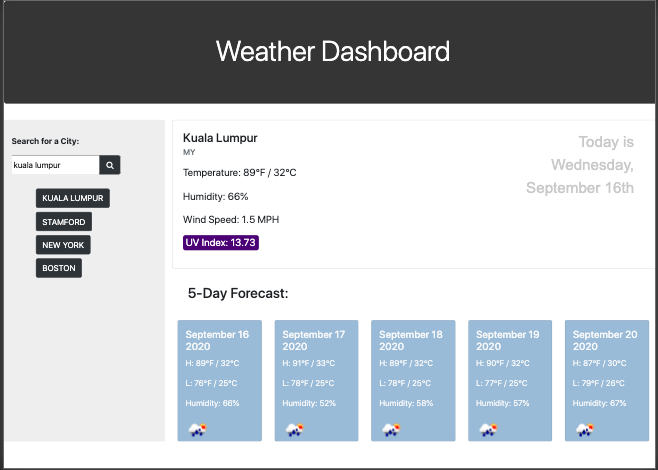

# Weather Dashboard

This is a simple weather dashboard application that pulls from multiple server-side API's, using Javascript, jQuery, and local storage. The HTML/CSS files were started from scratch.

Link: https://qdong327.github.io/weatherdashboard/

# Title

## Description 1-2 sentences
## Deployed Application:
## Technologies Used
## Screenshots (2-3)
## License (MIT) - add in Github to each
## Collaborators with contact, or Github if applicable.
